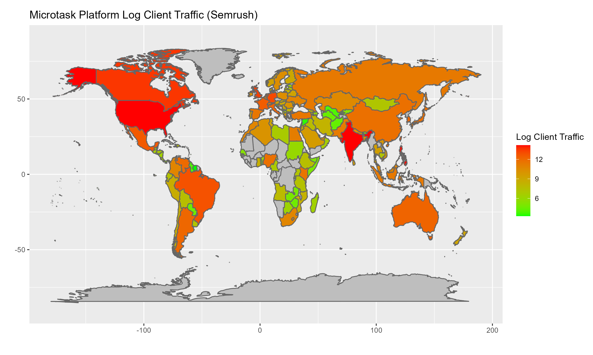

```{r setup, include=FALSE}
knitr::opts_chunk$set(echo = TRUE, fig.align="center")
library(ggplot2)
library(cowplot)
```


## Abstract
Microtask labor, the process of completing small tasks via digital platforms for minimal pay, has rapidly expanded in recent years. Microtask workers contribute to AI development by providing data for machine learning models through tasks such as image labeling and text transcription. Despite their crucial role, the human geography of this invisible population of workers remains largely unexplored, with limited understanding of its distribution and the factors that influence it. Here, using web traffic data and macroeconomic data, we show that COVID cases, GDP, and population are significant predictors of microtask labor traffic in a linear model. Our findings reveal a greater understanding of the geographies of microtask clients and workers, as well as the criteria that make certain countries targets for microtask platforms. This study contributes to the broader discourse on the invisible gig economy, providing insights into the factors shaping the landscape of microtask labor and its implications for the future of work.

## Literature Review

The focus of this senior project is on the human geography of workers who provide their labor to digital platforms in the form of microtasks. A paper by Tubaro et al. (2020) posits that in today's "datafied" economy, AI production requires human assistance to generate data to feed these models. Micro-workers, who typically receive low compensation for tasks such as labeling images, transcribing text, and flagging inappropriate content, produce the data that can be used to improve supervised machine learning models over time (Tubaro et al., 2020).

Another paper by Florian Alexander Schmidt (2017) categorizes this type of labor under the umbrella term "cloud work," which encompasses microtasking crowd work, freelance marketplaces, and contest-based creative crowd work. Cloud work tasks can be done remotely and are not tied to a specific location, while microtasks are small tasks that offer workers a minimal monetary reward upon completion. Examples of platforms that fall under the cloud work category, according to this paper, include Upwork and Amazon MTurk, both of which will be examined in this project.

Workers on these platforms constitute an "invisible population" because it is difficult to find information about their identities online. This low-paid work can be dehumanizing, and it is possible that microtask platforms intentionally target workers from unstable geographies. In his book "Humans as a Service: The Promise and Perils of Work in the Gig Economy," Jeremias Prassl suggests that when work becomes the service or commodity, traditional responsibilities of employers, such as providing minimum wages, social security, training, and job security, can be avoided, resulting in lower prices for consumers and increased profits for employers (p. 5). As AI development relies heavily on the controversial use of such "humans-as-a-service" labor, it is essential to delve deeper into this area.

There has been limited prior work on studying this invisible population. In a different paper by Tubaro et al. (2020), the authors focused on estimating the number of micro-workers in France using traffic aggregators like Similarweb. The goal of this senior project is to further explore worker geographies and their changes over time. Traffic aggregators such as Similarweb and Semrush will be utilized to examine the shifts in the popularity of this labor and to identify indicators responsible for country-specific or aggregate fluctuations in usage.


## Methods and Data
The data used to gauge the popularity of these platforms will be obtained from traffic aggregators Similarweb and Semrush.

Similarweb's mission is to measure the digital world, specifically online traffic, so it can be analyzed for insights. According to their website, they collect 10 billion signals and analyze 2 TB of data daily. However, the source of this data is somewhat unclear. Their website states that they have a "unique mix of digital signals obtained from a variety of unique sources," which is quite vague ("Our Data," 2023). They mention that they acquire data from Google Analytics and publicly available sources (Wikipedia, census data, etc.). Additionally, they collect anonymous traffic data from millions of devices with Similarweb products installed and obtain data from ISPs and corporate intelligence firms. They are unwilling to reveal their specific sources. There are legitimate concerns that using this data (and paying the platform for access to it) contributes to unethical surveillance. To promote transparency, all datasets compiled and findings discovered using Similarweb will become open source and publicly available.

For this project, Similarweb data will be used to determine the geographic distribution of the platforms of interest. However, the acquired subscription only allows access to data from the last three months, which is a limitation of this platform.

Semrush will be used more extensively in this project since a subscription to the service allows for traffic data to be downloaded from the last six years, with both annual and monthly resolutions, which is crucial for any time series analysis conducted. For website traffic analytics, Semrush collects data from "hundreds of partnerships with clickstream data providers," anonymizes the data, and uses machine learning to estimate various variables ("Semrush Data," 2019). The number Semrush provides is organic search traffic, which tracks visits to a website that begin with a search engine query and clicking on one of the results. This is only one of the methods that a freelancer can use to access a microwork website, with others including clicking an ad or directly entering the URL. We will use this organic search data as a proxy for the total traffic to those platforms, acknowledging that it is not the most precise but should still reveal general tendencies.

As both Semrush and Similarweb platforms will be used for data collection, it is essential to acknowledge the data limitations faced by this project. Firstly, the geographic data from the platforms is only an estimate, as both platforms have their own providers and statistical methods for sampling and estimating the true numbers. A section of this report compares the data from the two platforms, showing that while generally consistent, there is a significant variance. Additionally, VPN usage may alter the geographic results, especially since freelancers might be incentivized to use a VPN to access better pay in a different geographic region.

Certain macroeconomic data was also used for this project. The World Bank provided recent GDP and Age Dependency Ratio data. Household size data was obtained from the United Nations. Daily coronavirus data was downloaded from "Our World in Data." All of these sources are cited at the bottom.

## Project Summary
The data exploration and visualization section will show some overall trends over time as well as compare Semrush and Similarweb data for consistency. In the analysis section, we will first compare the geographies of workers and clients on these platforms. Then, we will create a list of countries that look like they have been targeted by these platforms and determine what similar countries could be next. Lastly, we build a linear model predicting next period's traffic using relevant variables from today.

## Platform Summary
The following table shows all platforms that we are analyzing, including the single-site domain or the worker/client specific domains.

| Company               | Single Domain                    | Worker Subdomain         | Client Subdomain        | Description          |
|-----------------------|----------------------------------|--------------------------|-------------------------|----------------------|
| 2Captcha              | 2captcha.com                     |                          |                         | Captcha Platform     |
| Appen                 | ui.appen.com.cn^[This is from the Appen China platform, but part of the same company as annotate and connect.]  | (annotate or connect).appen.com | client.appen.com | AI Platform          |
| Clickworkers          | clickworker.com                  |                          |                         | AI Platform          |
| Fiverr                | fiverr.com                       |                          |                         | Freelancing Platform |
| Guru                  | guru.com                         |                          |                         | Freelancing Platform |
| Hive                  |                                  | hivemicro.com            | thehive.ai              | AI Platform          |
| Isahit                | isahit.com                       |                          |                         | AI Platform          |
| Kolotibablo           | kolotibablo.com/main             |                          |                         | Captcha Platform     |
| Microworkers          | microworkers.com                 |                          |                         | AI Platform          |
| Amazon                |                                  | worker.mturk.com         | requester.mturk.com     | AI Platform          |
| Microsoft             |                                  | prod.uhrs.playmsn.com    |                         | AI Platform          |
| Premise               |                                  | contributors.premise.com |                         | AI Platform          |
| Google                |                                  | raterhub.com             |                         | AI Platform          |
| Scale AI              |                                  | remotasks.com            | scale.com               | AI Platform          |
| Superannotate         | superannotate.com                |                          |                         | AI Platform          |
| Teemwork              | teemwork.ai                      |                          |                         | AI Platform          |
| Telus                 | telusinternational.ai            |                          |                         | AI Platform          |
| Toloka                |                                  | toloka.yandex.com        | platform.toloka.ai      | AI Platform          |
| Upwork                | upwork.com                       |                          |                         | Freelancing Platform |
| Wirk                  | wirk.io                          |                          |                         | AI Platform          |


## Data Exploration and Visualization
### Semrush and Similarweb Comparison
Since data is being collected from two different traffic aggregators, both with their own data collection and traffic forecasting methods, it is essential to examine the extent to which this data is consistent between the two sources. Semrush data is utilized more in this project because we have time-series data for it, but Similarweb data is valuable for comparing workers and clients. Therefore, it is crucial to ensure there is not excessive variance in this data.

The comparison was made between 2022 Semrush data and the last three months of available data for Similarweb. Some variance is expected, as the time periods do not align and the platform aggregators cannot record every single visit. Instead, they gather data from their sources and use their models to estimate actual traffic. The goal is to demonstrate that the two aggregators mostly agree on their findings.

\

\

It does seem that data from the aggregators lines up pretty well. The log country traffic share lined up particularly well, and the average visit length (per website per country) has a clear positive relationship as well (even though this is not one of the variables that will be analyzed in this study).

### Traffic Over Time
The popularity of these platforms varies year to year. The following graph shoes this variation:

\

It seems that total traffic to these platforms has peaked in 2019 (pre-pandemic) and was also very high in 2020, before dropping significantly into 2021 and 2022. A lot of this is due to the decline of raterhub.

### Market Dominance Over Time
This plot shows the top 5 websites in our datasets with the most traffic by year.

\


It seems that the dominance of Raterhub and Amazon MTurk has decreased over time, while newer entrants like Appen and Scale have increased their market share.


## Modeling and Analysis
There were 3 main goals of this project. The first is to compare the geographies of workers and clients on these platforms. The second is to determine what similarities there are between countries whose citizens are being targeted by these microtasks websites to join their platform. The last is to build a model that predicts the next period's traffic for certain inputs. This is what is covered in this section.

### Worker and Client Geography Comparison
For some of the platforms in our dataset, clients and workers use a different domain, allowing us to look at the client and worker traffic separately, noting any interesting difference in the geographic origin of that traffic. One example is Scale AI. Clients use [scale.com](scale.com) while workers use [remotasks.com](remotasks.com). 

There was some disagreement between Semrush and Similarweb regarding the geographic distributions. For the sake of completeness, we will include findings from both sources. Semrush provided actual traffic numbers, while Similarweb only gave us the country_traffic_share for each domain. In the case of Similarweb, we will average the country_traffic_share for every country across all relevant domains and plot that number (using available data from November 2022 to January 2023). For Semrush, we will sum the traffic numbers for each country across domains (across all available years: 2017-2022). Since the USA traffic is significantly larger for all these graphs, it skews the colors. As a result, we will use log traffic in the plots and constrain the USA color to be the same as the second-highest country (even though, as can be seen from the accompanying tables, the USA traffic is larger).

\


Top 20 Countries by Aggregated Worker Traffic (Semrush)

| Country            | Worker Traffic   |
|--------------------|-----------|
| USA                | 486457884 |
| India              | 116718632 |
| Philippines        | 101033560 |
| Venezuela          | 59400656  |
| Singapore          | 22372577  |
| Brazil             | 18647538  |
| Russia             | 17696913  |
| Indonesia          | 14390085  |
| Kenya              | 13290739  |
| Pakistan           | 9571977   |
| Colombia           | 9539224   |
| Croatia            | 8750672   |
| Bulgaria           | 8503458   |
| Canada             | 7746163   |
| Italy              | 7412942   |
| UK                 | 5620733   |
| Portugal           | 4258619   |
| Ecuador            | 4156700   |
| North Macedonia    | 4081871   |
| United Arab Emirates| 3840221  |


\

Top 20 Countries by Aggregated Client Traffic (Semrush)

| Country     | Client Traffic |
|-------------|---------|
| USA         | 14638750|
| India       | 1413923 |
| Philippines | 1335778 |
| Singapore   | 872102  |
| Canada      | 778593  |
| UK          | 645840  |
| Germany     | 487032  |
| Brazil      | 377949  |
| Taiwan      | 331909  |
| Mexico      | 297357  |
| France      | 266505  |
| Italy       | 217377  |
| Netherlands | 201736  |
| Australia   | 200176  |
| South Korea | 183454  |
| Argentina   | 176567  |
| Venezuela   | 161273  |
| Israel      | 137013  |
| Japan       | 127464  |
| China       | 124725  |


\

Top 20 Countries by Averaged Worker Traffic % (Similarweb)

| Country   | Worker Traffic %|
|-----------|----------|
| USA       | 0.229    |
| India     | 0.120    |
| Brazil    | 0.087    |
| Philippines | 0.085   |
| Venezuela | 0.062    |
| Kenya     | 0.062    |
| Albania   | 0.058    |
| Colombia  | 0.042    |
| Nigeria   | 0.026    |
| Morocco   | 0.021    |
| Egypt     | 0.020    |
| Sri Lanka | 0.018    |
| Indonesia | 0.015    |
| Italy     | 0.015    |
| Pakistan  | 0.013    |
| Mexico    | 0.013    |
| Vietnam   | 0.011    |
| Australia | 0.010    |
| Iraq      | 0.007    |
| Turkey    | 0.007    |


\

Top 20 Countries by Averaged Client Traffic % (Similarweb)

| Country            | Client Traffic %  |
|--------------------|----------|
| USA                | 0.346    |
| UK                 | 0.098    |
| Canada             | 0.052    |
| India              | 0.049    |
| Russia             | 0.049    |
| Belize             | 0.041    |
| Netherlands        | 0.033    |
| Brazil             | 0.027    |
| France             | 0.025    |
| Philippines        | 0.024    |
| Indonesia          | 0.023    |
| Dominican Republic | 0.020    |
| Nigeria            | 0.019    |
| Kazakhstan         | 0.019    |
| Turkey             | 0.019    |
| Malawi             | 0.017    |
| Singapore          | 0.015    |
| Spain              | 0.015    |
| Egypt              | 0.014    |
| United Arab Emirates | 0.012  |


While the worker and client distributions are certainly related, it seems that clients are more likely to be from places like Mexico, Canada, the European Union, China, and Australia. There is a lot of client traffic from India, Brazil, Russia, and Venezuela as well. However, these countries are most represented from the worker side.

It is also interesting to see how this changes over time. The below charts show the square root of the traffic (from Semrush) by year for the top 5 countries for both clients and workers.

\

\


### Targeted Countries
In the microtask industry, clients are more likely to use platforms with a readily available labor force, while workers join platforms with the promise of a good income. Consequently, these platforms often provide short-term incentives to attract workers early on, phasing them out over time, which "attract[s] the other side to join" (McIntyre, D. P., & Srinivasan, A., 2017).

The objective is to compile a list of countries whose citizens may have been targeted by such incentives and identify commonalities among them. This information can then be used to make educated guesses about which countries might be targeted in the future.

To do this, annual Similarweb data is used for the following recruitment platforms: Hive, Scale, Microworkers, and Appen. We plot the traffic per year for the most popular countries on these platforms. If we observe a spike in traffic for a specific country without corresponding spikes in other countries during the same year, we assume workers in that country were targeted with incentives. Here is an example of what those spikes might look like:

\

For microworkers, we can see traffic spikes occur for these popular countries, but most of them occur in different years. After doing this process for a few more countries, the following list of countries (iso codes) has been created: ph, us, vn, pk, in, ve, id, bd, bg, np, co, ro, mx, ke.

Plotting these targeted countries with all the others, we get the following plot:

\

Except for the United States, these countries generally have low to medium GDP per capita, a middle-range Human Development Index, and a higher than average log(GDP). This is logical, as the low wages offered by these platforms are likely to attract workers from countries with low and medium GDP per capita. Simultaneously, this type of work demands certain technical skills, access to reliable internet, and personal computers, which are more prevalent in countries with better-developed infrastructure and higher overall GDP.

Excluding the United States, the other targeted countries all had the following characteristics:

* Human Development Index between 0.55 and 0.83
* 2021 GDP between \$1.45B and \$3.2T.
* GDP Per Capita between \$2900 and \$24500 

Initially, our dataset contained 179 countries. After applying this criteria, the list is reduced to 78, which is still a big number but over a two-fold reduction. This list includes the original countries that were targeted.

| Potential Microtask Target Countries      |
|-----------------|----------------|---------------|
| Albania         | Angola         | Antigua and Barbuda |
| Armenia         | Azerbaijan     | Barbados      |
| Belarus         | Belize         | Bhutan        |
| Bolivia         | Bosnia and Herzegovina | Botswana |
| Brazil          | Bulgaria       | Cabo Verde    |
| Cambodia        | Cameroon       | Colombia      |
| Congo, Rep.     | Costa Rica     | Dominican Republic |
| Ecuador         | Egypt, Arab Rep. | El Salvador  |
| Equatorial Guinea | Eswatini     | Fiji          |
| Gabon           | Georgia        | Ghana         |
| Guatemala       | Guyana         | Honduras      |
| India           | Indonesia      | Iran, Islamic Rep. |
| Iraq            | Jamaica        | Jordan        |
| Kazakhstan      | Kenya          | Kyrgyz Republic |
| Lao PDR         | Lebanon        | Libya         |
| Maldives        | Mauritius      | Mexico        |
| Moldova         | Mongolia       | Montenegro    |
| Morocco         | Myanmar        | North Macedonia |
| Nicaragua       | Pakistan       | Panama        |
| Papua New Guinea | Paraguay      | Peru          |
| Philippines     | Romania        | Serbia        |
| South Africa    | Sri Lanka      | St. Lucia     |
| Suriname        | Thailand       | Timor-Leste   |
| Tunisia         | Ukraine        | Uruguay       |
| Uzbekistan      | Vietnam        | West Bank and Gaza |
| Zambia          |                |               |


### Future Traffic Prediction Model
Another question we wanted to address was whether COVID cases had any effect on traffic to these platforms. The hypothesis was that higher COVID cases would lead to increased traffic on these platforms, as more workers would be working from home and exploring various online opportunities.

The model to be built is a linear model with the output being log(traffic) in the next period. Potential independent variables include log(traffic) in the current period, various macroeconomic measurements like GDP, life expectancy, and others, as well as COVID cases in the present time period.

To ensure that a linear model is appropriate, we had to verify that the relationships we observed were indeed linear.

Monthly Scatterplots:


\


Annual Scatterplots:


\

Unsurprisingly, there is a strong linear relationship between traffic in the current period and traffic in the future period. For many of these variables, we use a log transformation to ensure the relationship is close to linear. There are some other moderate-strength linear relationships, particularly in the annual case. The theory is that annual data has less variance than monthly data, so without the extra noise, certain relationships become clearer. As a result, the modeling will be performed on annual data, predicting the traffic for the next year using data from the previous year.

\

From the correlation pairplot, we can see positive correlations of future traffic with present traffic, population, gdp, and covid_cases. Most of the correlations we see are statistically-significant due to the size of our data, which is about 4,000 observations.

The following is the output of the initial linear model:

\begin{verbatim}
Call:
lm(formula = log_future ~ log_traffic + log_population + log_cases + 
    log_gdp + log_capita + life_expectancy + traffic_pct + dep_ratio + 
    avg_hh_size, data = df_annual)

Residuals:
    Min      1Q  Median      3Q     Max 
-8.8363 -0.8304  0.0887  1.0622  6.7333 

Coefficients:
                 Estimate Std. Error t value Pr(>|t|)    
(Intercept)     -1.820433   0.756498  -2.406  0.01616 *  
log_traffic      0.759102   0.010101  75.155  < 2e-16 ***
log_population  -0.036908   0.096557  -0.382  0.70230    
log_cases        0.055866   0.015933   3.506  0.00046 ***
log_gdp          0.222479   0.099086   2.245  0.02481 *  
log_capita      -0.165205   0.112648  -1.467  0.14259    
life_expectancy -0.002266   0.008610  -0.263  0.79239    
traffic_pct     -0.044941   0.030022  -1.497  0.13450    
dep_ratio       -0.003972   0.003268  -1.215  0.22429    
avg_hh_size      0.066994   0.037516   1.786  0.07423 .  
---
Signif. codes:  0 ‘***’ 0.001 ‘**’ 0.01 ‘*’ 0.05 ‘.’ 0.1 ‘ ’ 1

Residual standard error: 1.661 on 3507 degrees of freedom
  (561 observations deleted due to missingness)
Multiple R-squared:  0.682,	Adjusted R-squared:  0.6812 
F-statistic: 835.8 on 9 and 3507 DF,  p-value: < 2.2e-16
\end{verbatim}

We see that many of the coefficients are not statistically significant. We will use backward stepwise regression until all the coefficients are significant. This is the model that we end up with:

\begin{verbatim}
Call:
lm(formula = log_future ~ log_traffic + log_cases + log_gdp + 
    log_population, data = df_annual)

Residuals:
    Min      1Q  Median      3Q     Max 
-9.3438 -0.8370  0.0815  1.0489  6.6472 

Coefficients:
                Estimate Std. Error t value Pr(>|t|)    
(Intercept)    -1.011162   0.378338  -2.673  0.00756 ** 
log_traffic     0.758802   0.009517  79.732  < 2e-16 ***
log_cases       0.062949   0.014168   4.443 9.12e-06 ***
log_gdp         0.040188   0.022594   1.779  0.07538 .  
log_population  0.088006   0.022476   3.915 9.18e-05 ***
---
Signif. codes:  0 ‘***’ 0.001 ‘**’ 0.01 ‘*’ 0.05 ‘.’ 0.1 ‘ ’ 1

Residual standard error: 1.668 on 3887 degrees of freedom
  (186 observations deleted due to missingness)
Multiple R-squared:  0.6757,	Adjusted R-squared:  0.6753 
F-statistic:  2025 on 4 and 3887 DF,  p-value: < 2.2e-16
\end{verbatim}


This model shows that higher traffic in the next period is predicted by traffic in the current period as well as a higher GDP, number of coronavirus cases, and population. 

With a multiple R-squared of 0.6757, this model fits the data pretty well. At the same time, a model that just uses log_traffic achieves an R-squared of 0.66. This highlights that, while there does exist a statistically-significant relationship between future traffic with COVID cases and population (and somewhat significant with GDP), this relationship is not very strong and that predicting the traffic in the next period is a challenging task.

## Conclusion and Areas for Future Research
Studying the invisible population of microtask workers is challenging due to limited and potentially unreliable data. Despite obtaining data from major traffic aggregators, noise can be introduced by VPN usage, particularly since work from one country may pay more than work from another, incentivizing workers to use VPNs. Nevertheless, some insights are evident. Countries like the United States, India, and Brazil are significant participants in this gig economy, both as clients and workers. Workers targeted by these platforms tend to come from countries with a medium Human Development Index, moderately high GDP, and low-to-medium GDP per capita. While predicting traffic in the next period is difficult, a country's current traffic, along with COVID cases, GDP, and population, are statistically significant predictors.

Future research could explore the reasons behind large annual traffic fluctuations in the aggregate, such as the peak in 2019 and 2020 followed by a decline. Incorporating inflation and unemployment rates into the model, if reliable data can be found for relevant countries, could also be valuable.

Improvements to the existing analysis might include accounting for VPN usage and separating worker and client data for websites where both parties use the same domain.

## Bibliography
Age dependency ratio (% of working-age population). Data. (n.d.). Retrieved April 3, 2023, from https://data.worldbank.org/indicator/SP.POP.DPND 

GDP (current US$). Data. (n.d.). Retrieved April 3, 2023, from https://data.worldbank.org/indicator/NY.GDP.MKTP.CD 

Mathieu, E., Ritchie, H., Rodés-Guirao, L., Appel, C., Giattino, C., Hasell, J., Macdonald, B., Dattani, S., Beltekian, D., Ortiz-Ospina, E., &amp; Roser, M. (2020, March 5). Coronavirus pandemic (COVID-19). Our World in Data. Retrieved April 3, 2023, from https://ourworldindata.org/coronavirus 

McIntyre, D. P., &amp; Srinivasan, A. (2017). Networks, platforms, and strategy: Emerging Views and Next Steps. Strategic Management Journal, 38, 141–160

Tubaro, P., Le Ludec, C., &amp; Casilli, A. A. (2020). Counting ‘micro-workers’: Societal and methodological challenges around new forms of labour. Work Organisation, Labour &amp; Globalisation, 14(1). https://doi.org/10.13169/workorgalaboglob.14.1.0067 

Prassl, J. (2019). Humans as a service: The promise and perils of work in The gig economy. Oxford University Press. 

Schmidt, F. A. (2017). Digital Labour Markets in the Platform Economy: Mapping the Political Challenges of Crowd Work and Gig Work . Retrieved February 16, 2023, from https://www.researchgate.net/publication/314719905_Digital_Labour_Markets_in_the_Platform_Economy_Mapping_the_Political_Challenges_of_Crowd_Workand_Gig_Work 

Our Data. Similarweb. (2023, March 21). Retrieved April 12, 2023, from https://www.similarweb.com/corp/ourdata/ 

Tubaro, P., Casilli, A. A., &amp; Coville, M. (2020). The trainer, the verifier, the imitator: Three ways in which human platform workers support artificial intelligence. Retrieved February 16, 2023, from https://journals.sagepub.com/doi/10.1177/2053951720919776 

United Nations. (n.d.). Household size and composition | population division. United Nations. Retrieved April 3, 2023, from https://www.un.org/development/desa/pd/data/household-size-and-composition 

Where does semrush data come from? Semrush. (2019, November 7). Retrieved April 12, 2023, from https://www.semrush.com/kb/998-where-does-semrush-data-come-from 

## Appendix
\

\

\

\

